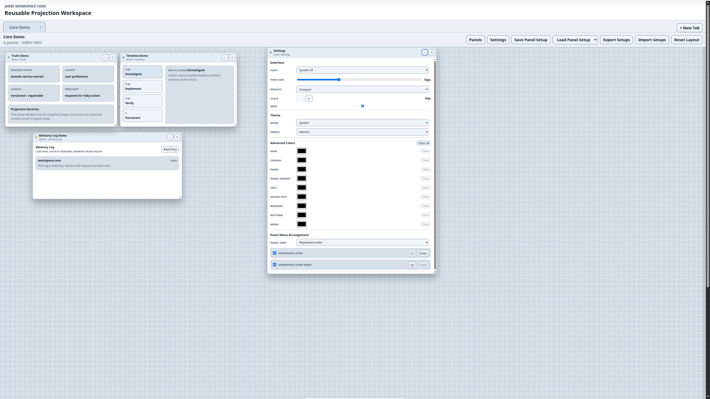

# Jarri Workspace Core

Reusable cognitive workspace substrate for Jarri-style panel, module, observatory, and operator-console systems.

---

## Overview

Jarri Workspace Core is a reusable projection workspace framework designed for:

- cognitive/operator-style workflows
- observatory interfaces
- replay-aware systems
- modular panel environments
- deterministic workspace persistence
- cross-project panel reuse

The project evolved from architectural concepts explored across:

- ChronoGit
- Jarri Workspace
- Jarri Spooty
- GitHub Traffic Intelligence (GTI)

Workspace Core is intended to become the shared substrate beneath these systems rather than another isolated UI.

---

## Current Features

### Workspace System

- multi-tab workspace
- persistent tab state
- panel-based projection system
- module-grouped panel registry
- panel setup save/load
- import/export of panel setups
- grid-based workspace layout
- scalable workspace zoom
- expandable logical workspace canvas

### Panel System

- movable panels
- resizable panels
- minimizable panels
- persistent panel geometry
- missing-panel recovery behavior
- module-driven panel registration

### Appearance System

- dark/light mode
- multiple visual presets
- custom color overrides
- adjustable font family
- adjustable font size
- adjustable workspace scale
- hide/show workspace grid

### Architecture

- deterministic layout persistence
- separation of logical geometry vs visual scale
- preview vs committed geometry lifecycle
- module runtime/bootstrap architecture
- provider-oriented future direction
- no heavy state-management framework

---

## Vision

Workspace Core is not intended to be:
- a dashboard framework
- a webpage layout system
- a traditional IDE clone

The long-term goal is a reusable cognitive workspace substrate capable of hosting:

- Git observatories
- traffic intelligence systems
- replay/timeline systems
- AI-assisted tooling
- distributed collaboration systems
- audio workspaces
- temporal/debugging surfaces
- operator consoles

---

## Development Doctrine

Core engineering doctrine:

    Investigate → Implement → Verify → Challenge → Document

Additional principles:

- deterministic behavior first
- logical geometry as source of truth
- repairable persistence
- modular runtime registration
- provider/projection separation
- no runtime truth persisted in panel state
- avoid unnecessary framework complexity

---

## Development

Install dependencies:

    npm install

Run development server:

    npm run dev -- --host 127.0.0.1

Typecheck:

    npm run typecheck

Build:

    npm run build

---

## Current State

Workspace Core is currently in active substrate development.

The next major direction is expected to include:

- provider contracts
- smart workspace fill/layout orchestration
- reusable cross-project modules
- observatory surfaces
- replay-aware workspace behavior
- GTI/ChronoGit/Spooty integration

---

## License

MIT
